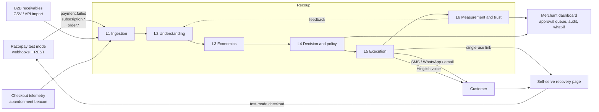
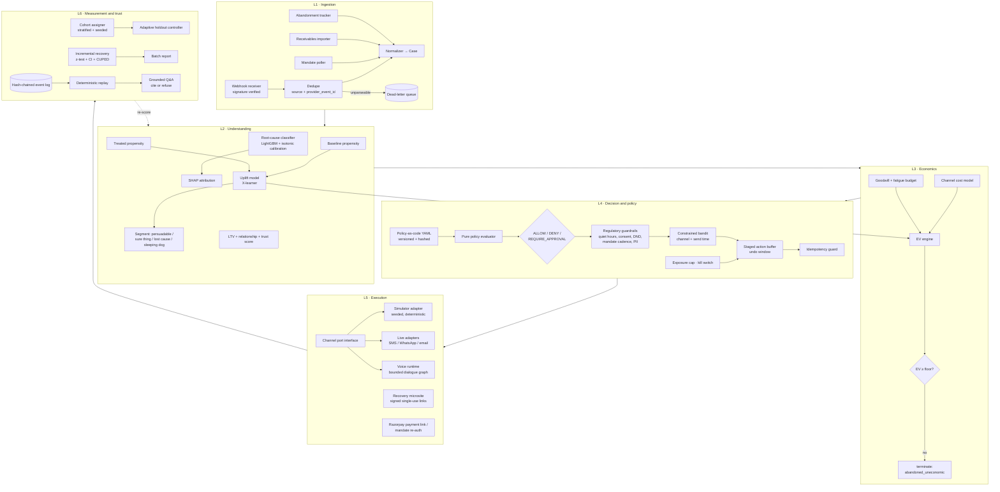
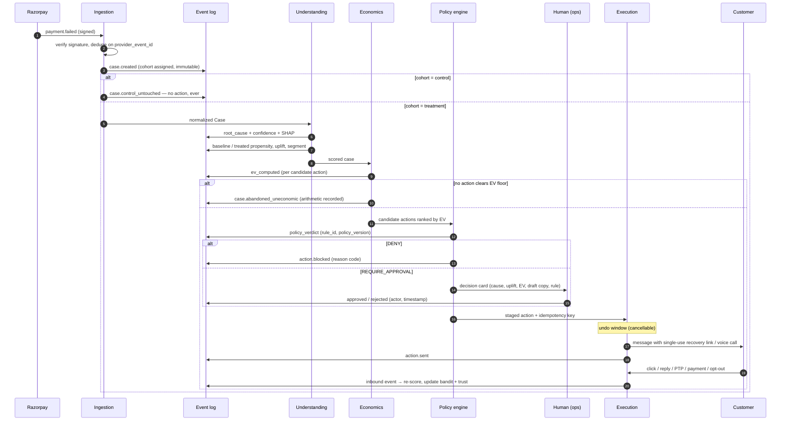
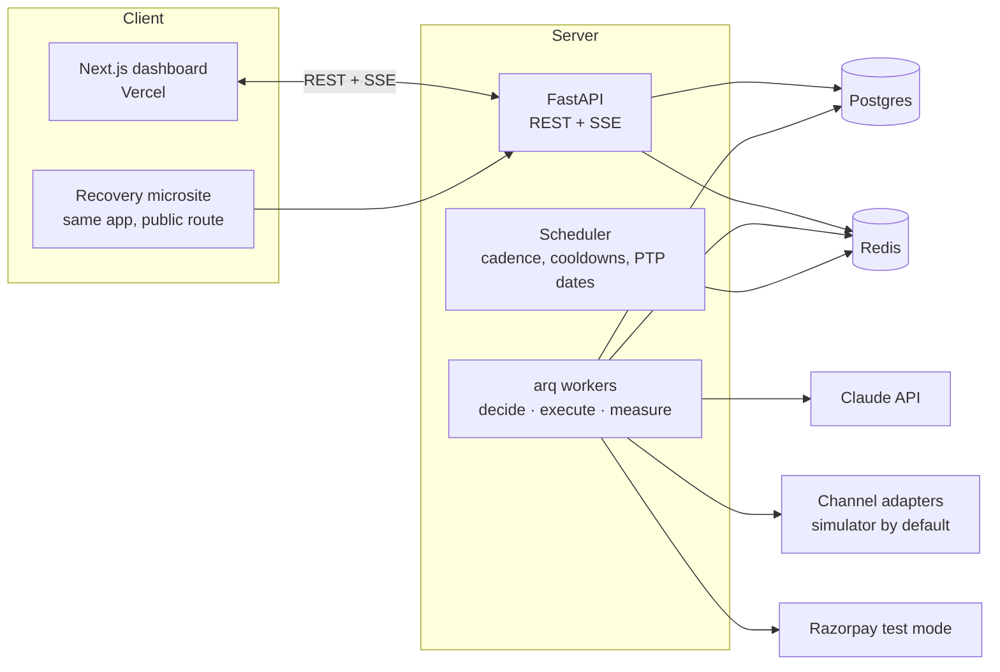
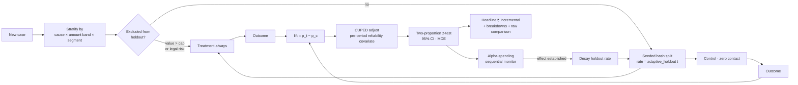

# Recoup — Architecture

| Field | Detail |
|---|---|
| Version | 2.0 |
| Companion to | `01-FRD.md`, `04-EXECUTION-PLAN.md` |
| Audience | Engineers, and judges reading the "architecture documentation" required by the submission |

---

## 1. Architectural thesis

> **The LLM proposes. Deterministic code disposes. The log remembers everything.**

Recoup is a **deterministic decision system with LLM assistance at the edges**, not an LLM agent with tools bolted on. This inverts the usual hackathon architecture, and it is the deliberate choice that makes the system safe to point at money.

Three invariants hold everywhere:

1. **No unlogged side effects.** Every state change is an event in an append-only log. State is a projection of events, never the other way round.
2. **No action without a verdict.** Every contact- or money-initiating action passes through a pure policy function that returns ALLOW / DENY / REQUIRE_APPROVAL with a rule ID, before anything is staged.
3. **No effect twice.** Every action carries a deterministic idempotency key; duplicates are suppressed and recorded, never executed.

---

## 2. Context diagram



---

## 3. Layered decomposition



---

## 4. The decision path for one case



---

## 5. Data architecture

### 5.1 Event sourcing with a hash chain

```
case_events(event_id, case_id, seq, occurred_at, recorded_at, actor,
            event_type, payload_json, policy_version, model_versions,
            prev_hash, hash)
```

- `hash = sha256(prev_hash ‖ canonical_json(payload) ‖ seq ‖ occurred_at)`
- The chain is per-case **and** globally linked through a batch anchor row, so a deleted case is detectable, not just a modified one.
- `cases` is a **projection** table rebuilt by `make replay`. Replay equality is a CI test: projecting the log must reproduce the stored projection byte-for-byte.
- Time travel is `fold(events where occurred_at <= T)`. The dashboard case timeline is literally this fold.

### 5.2 Why event sourcing here and not just an audit table

| Property needed | Audit table | Event sourcing |
|---|---|---|
| Reconstruct state at any past time | ✗ | ✓ |
| Prove no unlogged mutation happened | ✗ (state can change without a log write) | ✓ (state *is* the log) |
| Replay history through a *new* policy (what-if simulator) | ✗ | ✓ |
| Detect tampering | partial | ✓ (hash chain) |

The what-if simulator (FR-15.5) and the compliance replay (M5, M8) are both free consequences of this choice. That is why the extra complexity is justified — and `ADR-0002` records the trade-off.

### 5.3 Storage

- **Postgres 16** — cases, events, customers, policies, models, experiments. JSONB for payloads, generated columns + GIN indexes for query. Full-text search over event payloads powers grounded retrieval; `pgvector` is optional and only added if lexical retrieval proves insufficient (it usually doesn't at this scale — `ADR-0005`).
- **Redis** — queues, idempotency key set with TTL, rate limits, bandit posterior cache, SSE fan-out.
- **Object store / local disk** — raw payload archive, voice audio, model artifacts, batch report exports.

---

## 6. Runtime topology



- **API workers are stateless.** All coordination is Postgres + Redis.
- **Workers are the only component that executes actions.** The API never sends a message; it enqueues an intent. This gives one choke point for idempotency, staging and the kill switch.
- **The scheduler is not a cron of business logic.** It only wakes cases whose cooldown, cadence window, or PTP date has elapsed; the decision is always re-derived from current state.

---

## 7. The policy engine in detail

```python
# Pure. No I/O. No LLM. Fully unit- and property-testable.
def evaluate(case: Case, action: ProposedAction, ctx: PolicyContext) -> Verdict:
    """Returns Verdict(decision, rule_id, policy_version, reason, obligations)."""
```

Evaluation order is fixed and short-circuiting, hardest rules first:

1. **Kill switch / exposure cap** → DENY or REQUIRE_APPROVAL
2. **Cohort** — control case → DENY (`RULE-CTRL-001`)
3. **Regulatory** — consent, opt-out, DND, quiet hours, mandate cadence, re-auth-required, pre-debit notification → DENY
4. **Hard stopping rules** — max attempts, cooldown, terminal state, channel suppression → DENY
5. **Contact-fatigue budget** — rolling per-customer cap across all cases → DENY
6. **Ladder validity** — is this action the permitted next step for this root cause? → DENY
7. **Approval thresholds** — value, risk, formal-notice class, flagged account → REQUIRE_APPROVAL
8. Otherwise → ALLOW

Policies live in `policies/*.yaml`, are content-hashed into `policy_version`, hot-reload in dev, and are adopted explicitly in prod. Example:

```yaml
version: 2
ladders:
  mandate_revoked:
    description: "Mandate revoked by customer or bank. Never retry."
    steps:
      - action: send_reauth_link
        channels: [whatsapp, sms, email]
        wait_before: PT0S
      - action: send_reauth_reminder
        channels: [whatsapp, email]
        wait_before: P2D
      - action: stop
        reason: RULE-STOP-MANDATE-REAUTH
    forbidden_actions: [retry_charge]      # asserted by a property test
regulatory:
  quiet_hours: { start: "20:00", end: "09:00", tz: "Asia/Kolkata" }   # TRAI-aligned; verify before production
  mandate_retry:
    max_per_cycle: 3                       # configurable; verify against current NPCI circulars
    min_gap: P1D
    never_retry_causes: [mandate_revoked, mandate_insufficient_balance]
economics:
  ev_floor_inr: 5.00
  contact_fatigue: { max_contacts: 3, window: P30D }
approval:
  value_threshold_inr: 15000
  always_require: [formal_notice, high_risk_account]
```

**Property-based invariants** (Hypothesis) asserted over randomly generated case histories:

- `∀ history: contacts(history) ≤ policy.max_contacts`
- `∀ history: opt_out ∈ history ⇒ no contact after opt_out`
- `∀ history: cohort == control ⇒ actions(history) == []`
- `∀ history: root_cause == mandate_revoked ⇒ retry_charge ∉ actions(history)`
- `∀ history: |{a : a.idempotency_key == k}| ≤ 1 for all k`
- `∀ action: action.executed ⇒ ∃ verdict ∈ log with verdict.decision ∈ {ALLOW, APPROVED}`

The last one is the big one: **it is impossible to execute without a logged verdict**, and the test proves it rather than the README claiming it.

---

## 8. ML architecture

| Model | Type | Trained on | Consumed by | Guardrail |
|---|---|---|---|---|
| Root-cause classifier | LightGBM multi-class + isotonic calibration | Labelled synthetic failure events | Ladder selection, UI, audit | Confidence floor → conservative path |
| Baseline propensity | LightGBM binary | Control-arm outcomes | Uplift | — |
| Treated propensity | LightGBM binary | Treatment-arm outcomes | Uplift | — |
| Uplift (τ) | X-learner over the two above | Both arms | EV, targeting, priority | Negative τ ⇒ no contact |
| Channel-fit / send-time | Contextual bandit (Thompson sampling, Beta posteriors per (segment, channel, hour-bucket)) | Online outcomes | Action choice | Constrained to policy-permitted arms only |
| LTV / relationship | Gradient boosting on account features | Account history | Aggressiveness weighting, brake | Caps, never expands, permitted actions |
| PTP extraction | Claude with strict Pydantic schema | — (eval set of 60+ labelled utterances) | Escalation suspension | Confidence threshold → human verify |
| Message drafting | Claude, template-constrained | — | Copy only | Schema + safety + prohibited-claims check |
| Grounded Q&A | Claude over retrieved events | — (40-question CI benchmark) | Explainability | Cite-or-refuse, enforced in CI |

**Model governance:** every artifact is hashed with its training-data hash and metrics into `model_versions`; every decision records the model versions that produced it; a model card ships per model; CI fails if macro-F1 or Brier regress beyond a threshold.

---

## 9. Measurement architecture



The **adaptive holdout** is the piece worth defending out loud: a fixed 20% control forever is a permanent 20% tax on recovery. Sequential testing with an alpha-spending function lets the holdout shrink to a small monitoring slice once the effect is established, and re-expand automatically if the measured lift drifts outside its confidence band.

---

## 10. Failure architecture

| Failure | Detection | Response | Invariant preserved |
|---|---|---|---|
| Duplicate webhook | Dedupe key on `(source, provider_event_id)` | Ignore + log `event.duplicate_suppressed` | No duplicate case |
| Duplicate action attempt | Idempotency key in Redis + unique index | No-op + log suppression | No duplicate contact/charge |
| Out-of-order events | Apply by `occurred_at`; reconciliation pass | Late success retires in-flight actions | No reminder after payment |
| Malformed / unsigned payload | Schema + signature check | DLQ + exception queue | Nothing dropped silently |
| Provider 5xx / timeout | Bounded retry with jitter, circuit breaker | Reroute channel or defer; case stays consistent | No optimistic state mutation |
| LLM timeout / invalid schema / refusal | Pydantic validation + latency budget | Deterministic degradation: template copy, rule routing, `degraded_mode` flag | Safety never depends on the model |
| Worker crash mid-action | Staged-action state + lease expiry | Action resumes or expires cleanly; idempotency prevents replay effects | Exactly-once effect |
| Clock skew / DST | UTC internally, IST only at the edges | Quiet-hours evaluated in merchant tz | No 3am message |
| Model regression | CI metric gate | Build fails; previous model stays deployed | No silent quality loss |

Every one of these has a scenario in the chaos suite and a row in the demo's "Break it" menu.

---

## 11. Security and privacy

- Razorpay webhook **signature verification** on every inbound request; unsigned payloads never create cases.
- **No card PAN, ever** — tokenized references only; PCI scope avoided by design rather than by policy.
- **PII redaction before any LLM call**: names, phones, emails and account numbers are replaced with stable pseudonyms; a unit test asserts no raw phone/email pattern can appear in an outbound prompt.
- **Signed, single-use, expiring** recovery links (HMAC + nonce + TTL), rate-limited, with no enumerable identifiers.
- Secrets via environment/secret store only; least-privilege test-mode keys; `.env` never committed; a pre-commit secret scan.
- Customer-level export and deletion; configurable retention; log redaction for archived events.

---

## 12. Architecture decision records

Full ADRs live in `adr/`. Summary:

| ADR | Decision | Chosen | Rejected | Why |
|---|---|---|---|---|
| 0001 | Agent authority model | Deterministic core, LLM at edges | LLM-orchestrated tool loop | Money actions must be provable, not probable |
| 0002 | Case persistence | Event sourcing + projection | CRUD + audit table | Time travel, what-if replay, tamper evidence |
| 0003 | Workflow engine | Postgres + Redis + arq state machine | Temporal | Temporal is the right production answer; 8 days and a solo builder make its operational cost the wrong trade. Documented as the migration path |
| 0004 | Policy representation | Versioned YAML policy-as-code | Rules in Python, or rules in a prompt | Diffable, testable, reviewable by a non-engineer; never in a prompt |
| 0005 | Grounded retrieval | Postgres FTS over events first | pgvector/embeddings | Log entries are short and structured; lexical + structured filters outperform embeddings at this scale and are auditable |
| 0006 | Channels | Simulator-first behind a port | Live providers as the default path | Determinism, zero cost, demo safety; live adapters are a flag, never a dependency |
| 0007 | Uplift estimation | X-learner over two LightGBM models | Causal forest | Simpler, faster to train, adequate at this data scale; honest about the limitation |
| 0008 | Frontend | Next.js + Tailwind (hand-rolled components, see ADR-0008's update) | Streamlit | The dashboard is the judge's only direct experience of the product; it has to look like software, not a notebook |

---

## 13. Repository layout

```
recoup/                          # application repository
├── CLAUDE.md                    # always-loaded agent context
├── README.md                    # judge-facing entry point
├── Makefile                     # data · train · run · demo · replay · verify · chaos
├── docker-compose.yml
├── .github/workflows/ci.yml
├── docs/                        # ← git submodule → recoup-docs
├── context/                     # per-phase Claude Code context files
│   ├── shared/
│   └── phase-00 … phase-10
├── policies/                    # policy-as-code YAML (versioned, hashed)
├── src/recoup/
│   ├── domain/                  # Case, events, value objects — no I/O
│   ├── ingestion/               # webhooks, importers, dedupe, DLQ
│   ├── understanding/           # classifier, propensity, uplift, scoring
│   ├── economics/               # cost model, EV engine, fatigue budget
│   ├── policy/                  # pure evaluator, loader, simulator
│   ├── execution/               # channel ports, adapters, staging, idempotency
│   ├── voice/                   # dialogue graph, TTS/ASR, transcripts
│   ├── measurement/             # cohorts, adaptive holdout, stats
│   ├── audit/                   # event store, hash chain, replay, grounded QA
│   ├── llm/                     # Claude client, schemas, redaction, eval harness
│   ├── api/                     # FastAPI routes + SSE
│   └── workers/                 # arq tasks
├── ml/                          # training scripts, model cards, metrics artifacts
├── data/                        # seeded synthetic generator + fixtures
├── tests/                       # unit · property · integration · chaos · llm-eval
└── web/                         # Next.js dashboard + recovery microsite
```

---

## 14. What we would change with more time

Stated explicitly, because knowing the limits of your own design is part of the evaluation:

- **Temporal** for durable workflows once cadence logic outgrows a state machine and a scheduler.
- **A real uplift feedback loop** — v1 bootstraps uplift from the generator's ground-truth curves; production learns τ from accumulated holdout data, which needs weeks of traffic.
- **Per-merchant model isolation** and a feature store, rather than one global model.
- **A formal policy DSL with a proof obligation** per rule, instead of YAML plus property tests.
- **Human-in-the-loop learning**: approval and rejection decisions are logged but not yet used as training signal for the approval threshold itself.
